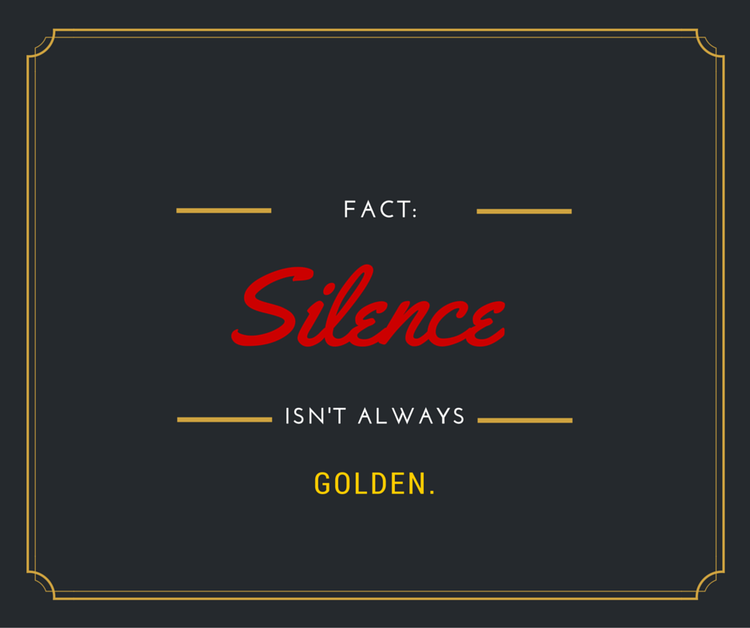

# Notes for the fine art of small talk

# Dẫn nhập
-   Xuất phát từ vấn đề vụng về và nhút nhát trong giao tiếp
-   Mặc cảm, tự ti về ngoại hình &rarr; tự tạo một bức tường ngăn cách với mọi người
-   Không giao tiếp &rarr; không biết cách nói chuyện &rarr; sợ giao tiếp
-   Làm thế nào để tự tin hơn? Giao tiếp tốt hơn
-   Chúng ta thường bị động trong giao tiếp, ngại ngùng khi bắt chuyện
-   Giá trị:
    -   Tạo dựng sự nghiệp kinh doanh
   doanh
    -   Kết bạn
    - Cải thiện kỹ năng giao tiếp
    - Hẹn hò
    - Kiếm được việc như mong muốn
- Kỹ năng đạt được:
  - Biết lôi cuốn bất cứ ai vào cuộc trò chuyện
  - Cứu vãn cuộc trò chuyện sắp bế tắc 
  - Chuyển đề tài câu chuyện
uyện
  - Cảm thấy thoải mái trong giao tiếp
  -   Kết thúc trò chuyện nhã nhặn
# Chương 1: Những khó khăn trong trò chuyện làm quen
-   Họ nghĩ rằng họ không có chuyện gì để nói với nhau
- Họ trốn tránh, tỏ ra bận rộn và tự cô lập bản thân để tránh giao tiếp với người khác
## Trò chuyện thành công
-   Trò chuyện đặt nền tảng cho mối quan hệ
-  Giỏi trò chuyện tức là khiến người khác cảm thấy gắn kết được tôn trọng và thoải mái
-   Giao tiếp giỏi không phải do bẩm sinh, điều cốt lõi là phải luôn học hỏi và luyện tập những kỹ năng đó
-   Không nhất thiết phải tìm mọi cách giao tiếp người lạ lẫn quen
-   Cách sống, làm việc và liên lạc hiện nay tạo ra khoảng cách trong giao tiếp với mọi người
-   Để giao tiếp tốt ta cần tập trung vào 2 mục tiêu
    -   Mạo hiểm: *không nên hy vọng người khác bắt chuyện trước, ta phải chủ động. Ta biết rằng có thể bị từ chối nhưng đó không phải là điều tồi tệ nhất.* 
    -   Gánh vác tránh nhiệm: *phải tạo ra chủ đề để trao đổi, phải nhớ tên mọi người, hạ nhiệt khi căng thẳng và lấp đầy khoảng trống trong trò chuyện*

## Lời nói chẳng mất tiền mua... nhưng lại rất có giá trị

- Xã giao cần thiết cho tạo dựng và phong phú các mối quan hệ, trò chuyện thân mật giúp gần gũi hơn 
- Tiền được dùng bởi 2 lí do sau:
  - Để giải quyết một vấn đề hay đáp ứng nhu cầu
  - Để có được cảm giác tích cực, vui vẻ

- Người giao tiếp tốt phải biết gợi cảm xúc tích cực ở người khác
- Trò chuyện tạo nên sự giao tiếp. Người ta thường sử dụng dịch vụ ở nơi có nhân viên nồng hậu, thân thiện và biết quan tâm 

## Giao tiếp ít nhưng vẫn đạt hiệu quả

- Dùng trò chuyện để tạo nhịp trước khi thảo luận căng thẳng &rarr; cơ hội tạo dựng quan hệ, đội ngũ kết dính, tăng khả năng thành công
- Giao tiếp con cái, hiểu cảm xúc và tình trạng của con cái
- Chuyện trò không phải vớ vẩn mà là kết nối mọi người
- Đánh giá đúng sức mạnh trò chuyện, nhận ra giá trị của trò chuyện là bước đi đầu tiên trước khi tiếp thu các kỹ năng, chứ không phải biến bạn thành người lẻo mép

# Chương 2 Biết vượt qua lời mẹ dạy

- Những bài học đầu đời khi bé làm chúng ta ngần ngại bắt chuyện:
  - Im lặng là vàng
  - Không nói chuyện với người lạ
- Những điều trên chỉ đúng khi còn bé, khi giữ an toàn, khi biết cách cư xử.
- Khi ta lớn, không phải gặp ai cũng gây nguy hiểm, không phải lúc nào cũng im lặng
## Trong hoàn cảnh bình thường, hãy bắt chuyện với người lạ
- Hãy gạt đi rụt rè, ngại ngùng bởi người lạ có thể mang đến nhịp sống mới cho bạn
## Hãy tự giới thiệu
- Nếu bạn lạc lõng giữa đám đông, tốt nhất nên tìm một ai đó có cảm giác đơn độc như bạn và lỗi kéo họ vào cuộc trò chuyện, chủ động giới thiệu bản thân

## Im lặng là mất lịch sự

- Im lặng đều có mặt tốt và xấu 
- Người hoạt bát có cơ hội và mối quan hệ rộng hơn người im lặng
- Sự e ngại có thể bị hiểu lầm là kiêu ngạo, đó là hai sự khác nhau hoàn toàn nhưng biểu hiện bên ngoài lại giống nhau

## Điều tốt đẹp chỉ đến với người biết tìm kiếm

- Chờ đợi mất nhiều thời gian 
- Những điều tốt đẹp chỉ đến với người biết chủ động và hành động tạo ra điều tốt đẹp

  *"Phải biết trèo cây thì mới đến được chỗ có nhiều hoa quả"* 

- Trèo cây có thể mạo hiểm nhưng bạn sẽ không hái được quả ngon nếu chỉ biết đứng chờ đợi

## Bắt chuyện trước là trách nhiệm của bạn

## Duy trì trò chuyện vẫn là trách nhiệm của bạn
- Đừng dựa vào người khác để tiếp tục cuộc trò chuyện
- Tránh những câu trả lời nhát gừng, cụt lủn
- Những câu hỏi phá vỡ sự im lặng chủ đề công việc:
  1.	Miêu	tả	một	ngày	làm	việc	điển	hình	của	bạn.
  2.	Sao	bạn	lại	có	ý	tưởng	này	?
  3.	Điều	gì	khiến	bạn	tham	gia	lĩnh	vực	này	?
  4.	Điều	khiến	bạn	hứng	thú	trong	công	việc	tiếp	thị/nghiên	cứu/giảng	dạy	?
  5.	Điều	bạn	yêu	thích	nhất	trong	công	việc	của	mình	là	gì	?
  6.	Điều	khác	biệt	giữa	bạn,	công	ty	của	bạn	với	các	đối	thủ	cạnh	tranh	?
  7.	Tại	sao	công	ty	của	bạn...	?
  8.	Kể	một	vài	thử	thách	trong	công	việc	của	bạn.
  9.	Bạn	dự	đoán	xu	hướng	sắp	tới	trong	lĩnh	vực	của	bạn	là	gì	?
  10.	Cách	hữu	hiệu	nhất	mà	bạn	biết	để	quảng	bá	cho	doanh	nghiệp	của	mình
  là	gì	?
  11.	Kể	lại	kinh	nghiệm	làm	việc	quan	trọng	nhất	mà	bạn	có	được.
  12.	Lời	khuyên	bạn	dành	cho	những	người	mới	bắt	đầu	trong	lĩnh	vực	như
  bạn	là	gì	?
  13.	Bạn	sẽ	làm	gì	khi	biết	chắc	mình	sẽ	không	thất	bại	?
  14.	 Những	 thay	 đổi	 đáng	 kể	 mà	 bạn	 chứng	 kiến	 trong	 công	 việc	 kể	 từ	 khi
  bạn	bắt	đầu	là	gì	?
  15.	Hãy	kể	lại	sự	cố	lạ	lùng	nhất	bạn	gặp	phải.
  16.	Công	việc	tốt	nhất	bạn	từng	làm	là	gì	?	Và	công	việc	tệ	nhất	?
  17.	Phần	khó	khăn	nhất	trong	công	việc	của	bạn	là	gì	?
  18.	Internet	có	ảnh	hưởng	như	thế	nào	đến	công	việc	của	bạn	?
  19.	Bạn	có	biết	ai	có	thể	giúp	tôi...	?
  20.	Hãy	nói	về	nền	kinh	tế/bầu	cử/mùa	hè	có	ảnh	hưởng	thế	nào	đến	côngviệc	của	bạn.

- Những câu hỏi phá vỡ im lặng trong lĩnh vực xã hội:
    1.	Bạn	nghĩ	gì	về	phim	ảnh/nhà	hàng/tiệc	tùng	?
    2.	Hãy	kể	về	kì	ìghỉ	thú	vị	nhất	của	bạn.
    3.	Bạn	thích	làm	gì	vào	những	ngày	mưa	?
    4.	 Nếu	 như	 bạn	 được	 tái	 diễn	 lại	 một	 khoảnh	 khắc	 trong	 cuộc	 sốngý	 đó	 là
    khoảnh	khắc	nào	?
    5.	Bạn	muốn	có	thứ	gì	nhất	?	Tại	sao	?
    6.	Hãy	kể	về	người	họ	hàng	bạn	yêu	quý	nhất.
    7.	Hãy	nói	về	thị	trấn	nơi	bạn	lớn	lên	?
    8.	Bạn	muốn	quay	trở	lại	nơi	nào	trong	thời	gian	tới	đây	?
    9.	Kể	cho	tôi	nghe	về	bọn	trẻ	nhà	bạn.
    10.	Bạn	cho	rằng	độ	tuổi	nào	là	hoàn	hảo	nhất	?	Tại	sao	?
    11.	Một	ngày	làm	việc	của	bạn	như	thế	nào	?
    12.	Trong	số	những	nơi	bạn	đã	sống,	hãy	kể	về	nơi	bạn	thích	nhất.
    13.	Kì	nghỉ	nào	bạn	ưa	thích	nhất	?	Bạn	tận	hưởng	những	gì	?
    14.	Những	truyền	thống	nào	của	gia	đình	mà	bạn	đặc	biệt	ưa	thích	?
    15.	Hãy	kể	về	chiếc	ô	tô/xe	máy	đầu	tiên	bạn	mua	?
    16.	Internet	ảnh	hưởng	như	thế	nào	đến	cuộc	sống	của	bạn	?
    17.	Ai	là	thần	tượng	hồi	nhỏ	của	bạn	?	Và	thần	tượng	đó	có	thay	đổi	không	?
    18.	Hãy	kể	về	người	thầy	bạn	nhớ	nhất.
    19.	Hãy	kể	về	một	bộ	phim/một	cuốn	sách	bạn	từng	xem/đọc	hơn	một	lần.
    20.	Nhà	hàng	ưa	thích	của	bạn	là	gì	?	Lí	do	?
    21.	Hãy	kể	tại	sao	bạn	được	đặt	tên	là	...	?	Hãy	kể	nguồn	gốc	họ	của	bạn	?
    22.	Hãy	kể	về	nơi	nào	bạn	đã	đến	và	mong	sẽ	không	bao	giờ	phải	trở	lại.
    23.	Điều	ngạc	nhiên	lớn	nhất	bạn	từng	có	là	gì	?
    24.	Điều	bất	ngờ	lớn	nhất	bạn	từng	lên	kế	hoạch	dành	cho	một	ai	đó	là	gì	?
    25.	Trượt	tuyết	 ở	nơi	 này	luôn	là	 thử	thách.	 Bạn	thích	trượt	 tuyết	ở	 những
    đâu	?
    26.	Ai	sẽ	đóng	vai	bạn	nếu	có	bộ	phim	về	cuộc	đời	bạn	?	Sao	lại	là	người	đó
    ?
    27.	Người	nổi	tiếng	nhất	mà	bạn	đã	gặp	là	ai	?
    28.	Hãy	kể	về	một	vài	giải	pháp	cho	cuộc	sống	và	công	việc	trong	năm	mới
    của	bạn.
    29.	Việc	thiếu	tổ	chức	nhất	mà	bạn	đã	từng	làm	là	gì	?
    30.	Kể	về	một	bộ	trang	phục	bạn	đã	mặc	đi	dự	tiệc.
    31.	Kể	về	địa	vị	chính	trị	mà	bạn	muốn	nắm	giữ.
    32.	Bài	hát	nào	gợi	nhớ	một	sự	cố	trong	cuộc	đời	bạn	?
    33.	Bữa	ăn	đáng	nhớ	nhất	của	bạn	là	ở	đâu	?
    34.	Sự	trùng	hợp	đáng	nhớ	nhất	mà	bạn	đã	từng	trải	qua	hay	được	biết	đến	?
    35.	Khi	thoải	mái,	bạn	có	thể	nói	chuyện	như	thế	nào	?
    36.	Nhân	vật	hoạt	hình	nào	bạn	muốn	được	phỏng	vấn	nhất	?	Vì	sao	?
    37.	Hãy	kể	với	tôi	về	gia	đình	bạn.
    38.	Mùi	hương	nào	gợi	đến	một	kỉ	niệm	đặc	biệt	?
    39.	Kể	về	người	đáng	sợ	nhất	bạn	từng	gặp.
    40.	Bạn	thích	làm	gì	một	mình	?
    41.	Hãy	kể	về	một	người	bạn	thời	thơ	ấu	chuyên	gây	rắc	rối	cho	bạn.
    42.	Kể	về	quãng	thời	gian	khi	bạn	ăn	hoặc	uống	quá	nhiều.
    43.	Kể	về	ba	tháng	sống	xa	nhà	đầu	tiên	của	bạn.
    44.	Kể	về	quãng	thời	gian	khi	bạn	thất	nghiệp.
    45.	Chia	sẻ	kỷ	niệm	về	một	người	ông/bà	của	bạn.
    46.	Kể	về	khoảnh	khắc	xấu	hổ	nhất	của	bạn.
    47.	 Kể	 cho	 tôi	 nghe	 về	 điều	 mà	 hầu	 hết	 mọi	 người	 thường	 không	 đoán	 về
    bạn.
    48.	Bạn	sẽ	làm	gì	nếu	như	kiệm	được	một	triệu	đô	la	?
    49.	Thời	tiết	như	thế	nào	được	bạn	cho	là	lí	tưởng	nhất	và	tại	sao	?
    50.	Bạn	đã	học	trượt	tuyết/chơi	piano	như	thế	nào	

# Chương 3 Trò chơi mạo hiểm: Bắt chuyện 
- Bạn hoàn toàn có thể bắt chuyện trước, bởi nó không hề khó như bạn nghĩ, mà bạn còn làm chủ được định mệnh của mình
- Nguyên tắc:
  - Khi ai đó trao bạn nụ cười, hãy cuời đáp lại.
  - Hãy là người cười và người chào người khác trước
  - Tỏ ra hứng thú, trao cả ánh mắt với người khác
  - Luyện tập thường xuyên với mọi người 
  
## Ý nghĩa những cái tên
- Đừng chỉ đi ngang và nói xin chào, nên đứng lại trò chuyện
- Tìm cách nhớ tên người khác
- Tập trung khi người khác giới thiệu, nhắc lại tên họ trong lời chào của bạn
- Để nhớ tên hãy luôn gọi tên họ trong cuộc trò chuyện
- Hãy tập trung vào tên họ, nhắc lại trong đầu rồi mới nghĩ câu trả lời
- Người ta thích được hỏi lại tên hơn là bị gọi sai tên &rarr; cấm kị
- Đừng lảng tránh chỉ vì không nhớ tên họ
- Gặp người khó nhớ tên hãy tỏ ra quan tâm đến tên của họ thay vì lười biếng sẽ bị họ cho rằng tên của họ không đáng để bạn nhớ
- Học cách nhớ tên là một phần tất yếu của cuộc trò chuyện

## Hãy cẩn thận với những biệt danh
- Không nên gọi tắt bằng biệt 34.	Sự	trùng	hợp	đáng	nhớ	nhất	mà	bạn	đã	từng	trải	qua	hay	được	biết	đến	?
35.	Khi	thoải	mái,	bạn	có	thể	nói	chuyện	như	thế	nào	?
36.	Nhân	vật	hoạt	hình	nào	bạn	muốn	được	phỏng	vấn	nhất	?	Vì	sao	?
37.	Hãy	kể	với	tôi	về	gia	đình	bạn.
38.	Mùi	hương	nào	gợi	đến	một	kỉ	niệm	đặc	biệt	?
39.	Kể	về	người	đáng	sợ	nhất	bạn	từng	gặp.
40.	Bạn	thích	làm	gì	một	mình	?
41.	Hãy	kể	về	một	người	bạn	thời	thơ	ấu	chuyên	gây	rắc	rối	cho	bạn.
42.	Kể	về	quãng	thời	gian	khi	bạn	ăn	hoặc	uống	quá	nhiều.
43.	Kể	về	ba	tháng	sống	xa	nhà	đầu	tiên	của	bạn.
44.	Kể	về	quãng	thời	gian	khi	bạn	thất	nghiệp.
45.	Chia	sẻ	kỷ	niệm	về	một	người	ông/bà	của	bạn.
46.	Kể	về	khoảnh	khắc	xấu	hổ	nhất	của	bạn.
47.	 Kể	 cho	 tôi	 nghe	 về	 điều	 mà	 hầu	 hết	 mọi	 người	 thường	 không	 đoán	 về
bạn.
48.	Bạn	sẽ	làm	gì	nếu	như	kiệm	được	một	triệu	đô	la	?
49.	Thời	tiết	như	thế	nào	được	bạn	cho	là	l{	tưởng	nhất	và	tại	sao	?
50.	Bạn	đã	học	trượt	tuyết/chơi	piano	như	thế	nào	danh nếu như không được sự đồng ý của họ
- Gọi người khác bằng tên chứng tỏ bạn quan tâm đến họ và khiến cho họ cảm thấy bản thân đặc biệt

## Nên cho đi nhiều hơn những gì hi vọng nhận được
- Giới thiệu lại tên bạn khi gặp lại ai đó là việc nên làm
- Điều này giúp người khác không bị khó xử nếu lỡ quên tên mình
- Đừng bao giờ áp đặt ai đó thường xuyên gặp bạn nghĩa là sẽ nhớ tên bạn, nhất là trong bối cảnh khác nhau

# Chương 4 Duy trì cuộc nói chuyện
